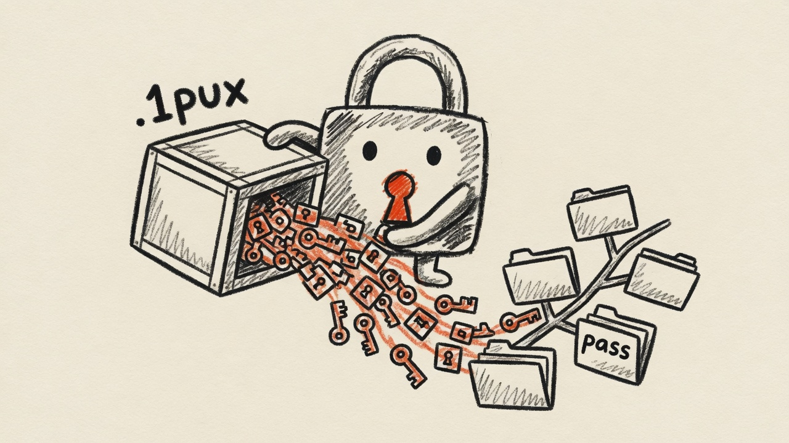

# import-1p-to-pass

<p align="center">
  
</p>

Import a 1Password **Unencrypted Export** (`.1pux`) into
[pass](https://www.passwordstore.org/), the standard Unix password manager.

Unlike 1Password's `.1pif`/`.csv` exports, `.1pux` preserves custom fields, TOTP
secrets, and file attachments — and this tool maps all of them into pass.

## How it works

The `.1pux` file is a ZIP containing `export.data` (a JSON tree of
`accounts → vaults → items`) and a `files/` folder of attachments. For each item
the importer builds a pass-style multiline entry and writes it with
`pass insert -m`:

- **Line 1** is the password (login password, standalone password, or a credit
  card number; blank for items with no secret, e.g. secure notes).
- Following lines are `key: value` metadata: `username`, `url`(s), every custom
  section field, `tags`, and `attachment` names.
- TOTP fields become `otpauth://…` lines, compatible with
  [pass-otp](https://github.com/tadfisher/pass-otp).
- Notes (`notesPlain`) are appended verbatim at the end.

Entries are filed under a **category folder**:
`logins/…`, `passwords/…`, `secure-notes/…`, `credit-cards/…`, `identities/…`,
`documents/…`, etc. (unknown categories fall back to `category-<uuid>/…`).
Name collisions get a short uuid suffix.

Attachments are GPG-encrypted to the store's recipients and written next to their
entry as `<entry>.attachments/<file>.gpg`.

## Usage

```sh
# Preview everything without touching the store (recommended first):
import-1p-to-pass --dry-run export.1pux

# Import into the default store ($PASSWORD_STORE_DIR or ~/.password-store):
import-1p-to-pass export.1pux

# Import into a scratch store to inspect the result first:
import-1p-to-pass --store-dir /tmp/teststore export.1pux

# Keep vaults separate by nesting entries under the vault name:
import-1p-to-pass --vault-prefix export.1pux
```

By default an entry is filed as `<category>/<title>` (e.g.
`logins/github`). With `--vault-prefix` it becomes `<vault>/<category>/<title>`
(e.g. `Personal/logins/github`, `Work/logins/github`) — useful when you have
several vaults and want to preserve that separation, or when the same login
exists in more than one vault.

### Options

| Flag | Effect |
|------|--------|
| `--dry-run` | Render entries to stdout; don't write the store. |
| `--force` | Overwrite entries that already exist. |
| `--store-dir <PATH>` | Use this dir as `PASSWORD_STORE_DIR`. |
| `--vault-prefix` | Nest entries under the vault name: `<vault>/<category>/<title>`. |
| `--include-archived` | Also import archived items (skipped by default), filed under an `archived/` prefix, e.g. `archived/logins/github`. |
| `--no-totp` | Don't emit `otpauth://` lines. |
| `--no-attachments` | Don't extract file attachments. |
| `--password-history` | Append previously-used passwords as a `password history:` block (off by default — these are stale secrets). |

## Building

Requires a Rust toolchain (pinned via `mise.toml`) plus `pass` and `gpg` at
runtime.

```sh
mise install     # provisions rust
cargo build --release
cargo test       # unit tests + an end-to-end test against a throwaway store
```

## Exporting from 1Password

In the 1Password 8 desktop app: your account name → **Export** → choose the
account → format **1PUX**. Keep the resulting file safe — it is **unencrypted**.
Delete it once the import is verified.
